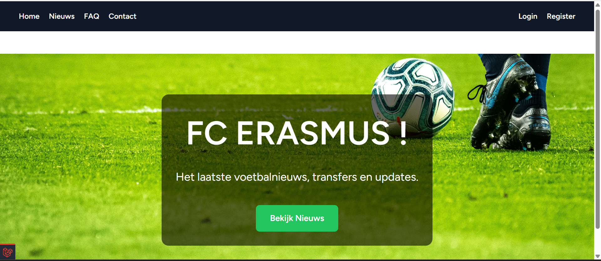
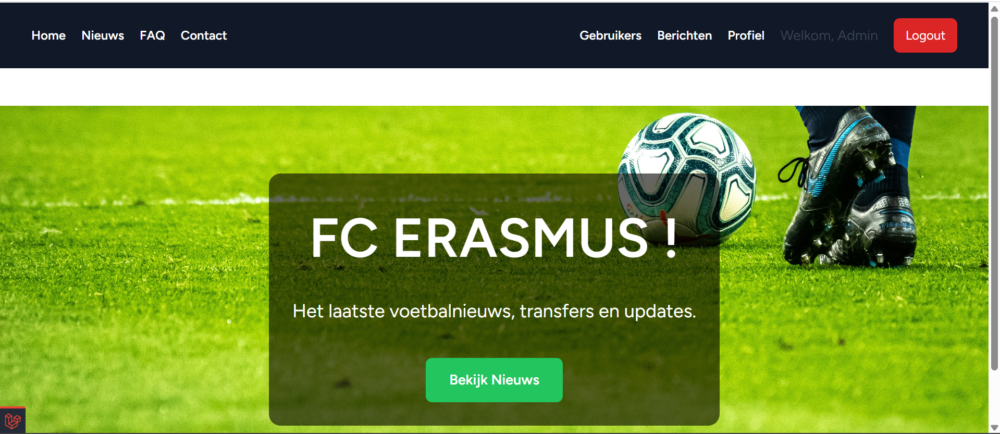
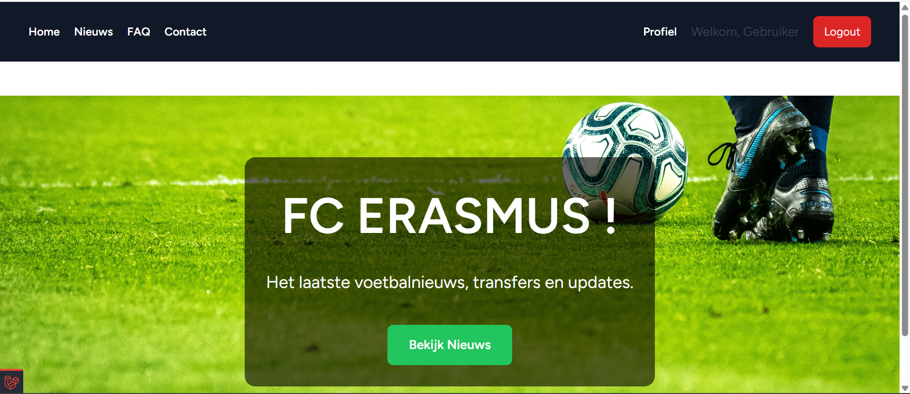

# Backend Web Eindopdracht

## Projectbeschrijving

Een dynamische website voor een voetbalclub FC Erasmus, gebouwd met Laravel. Bezoekers kunnen het laatste nieuws lezen, FAQs raadplegen, een contactformulier invullen en reacties achterlaten. Admins kunnen alles beheren via een apart admin-gedeelte.

## Functionaliteiten

- Login, registratie en wachtwoord resetten 
- Admin kan gebruikers beheren: admin-rechten geven/nemen, nieuwe users aanmaken
- Elke gebruiker heeft een publiek profiel met username, verjaardag, profielfoto en bio
- Nieuwsartikelen met titel, afbeelding, inhoud en publicatiedatum
- FAQ overzicht gegroepeerd per categorie
- Contactformulier dat wordt opgeslagen in de database
- Reacties op nieuwsartikelen (enkel ingelogde gebruikers)
- Admin dashboard voor contactberichten

## Standaard admin account

Username: admin
Email: admin@ehb.be
Password: Password!321

## Technische vereisten

Twee layouts - app.blade.php en guest.blade.php in /layouts

Component - @include(app_navigation) in app.blade.php

Control structures - @if, @foreach in alle views bv news/index.blade.php lijn 92, 97

XSS protection - {{ }} in alle views

CSRF protection - @csrf in alle forms bv contact/create.blade.php lijn 48

Client-side validatie - required, maxlength in forms bv news/create.blade.php lijn 21-24

Routes via controllers - routes/web.php alle routes naar [Controller::class, method]

Middleware - middleware auth in web.php op lijn 18, 31, 42, 54

Route groups - web.php news lijn 18, faq lijn 31, comments lijn 42, admin lijn 54

CRUD methods - NewsController.php lijn 10-97 en FaqController.php lijn 10-93, 7 methods elk

Category grouping - FaqController.php lijn 14-16 met $grouped per category

One-to-many - User.php lijn 56 en 61 met hasMany, News/Faq/Comment.php met belongsTo

Many-to-many - News.php lijn 28 belongsToMany(Tag), Tag.php lijn 14 belongsToMany(News)

File upload - ProfileController.php lijn 43-45 met $request-file-store

Contact opslag - ContactController.php lijn 24-28 met new Contact en save

Email log - ContactController.php lijn 40 met file_put_contents

Authenticatie - Breeze starterpack login, register, wachtwoord reset, remember me

Extra comments - CommentController.php lijn 11 store en lijn 36 destroy

Extra admin contacts - ContactController.php lijn 46 index, route /admin/contacts

## Installatiehandleiding

1. Clone de repository
    git clone https://github.com/Yassine1000L/ExamenBackendYassine
   cd ExamenBackendYassine

2. Installeer dependencies
   composer install
   npm install
   

3. Omgeving instellen
   
   copy .env.example .env
   php artisan key:generate
   

4. Storage link voor afbeeldingen
   
   php artisan storage:link
   

5. Migraties en seeders uitvoeren
   
   php artisan migrate:fresh --seed
   

6. Frontend builden
   
   npm run build
   

7. Server starten
   
   php artisan serve
   

8. Open in browser en login met -> admin@ehb.be en password -> Password!321

## Gebruikte bronnen

- Cursus Backend Web modules 0-8 (Nico Deblauw)
- Starterpack van Nico Deblauw (Breeze)
- Laravel documentatie (laravel.com/docs)
- AI voor hulp bij code, debugging en uitleg van laravel alert 
- 

## Screenshots

